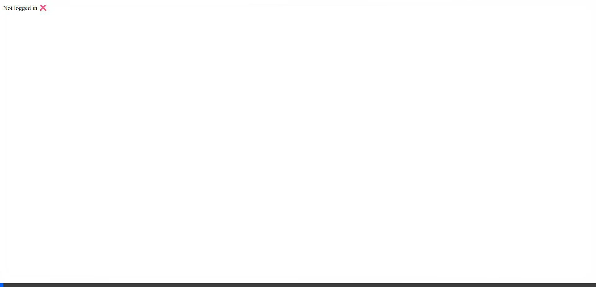
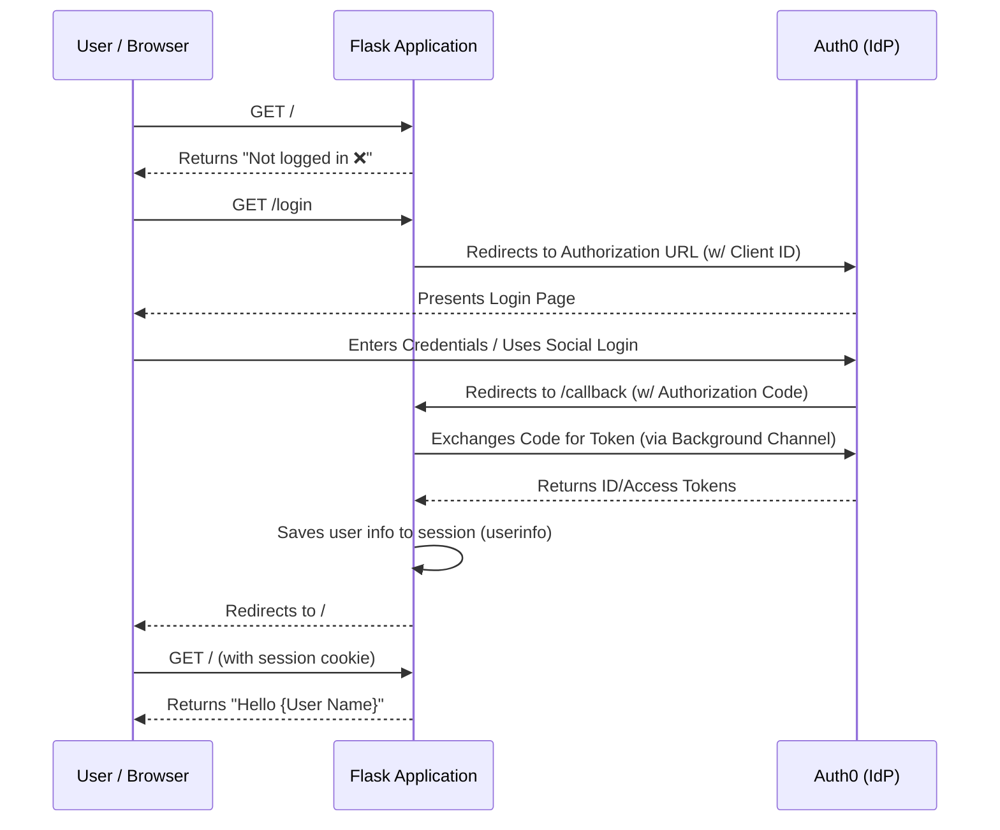

# Auth0 Python Flask Demo 🛡️

A secure, lightweight Python Flask application demonstrating integration with Auth0 for authentication and authorization. This project acts as an Identity Relying Party, leveraging standard OAuth 2.0 and OpenID Connect protocols to securely manage user sessions.

## 🚀 Features
- **Secure Authentication:** Integrates Auth0 for robust user authentication.
- **Session Management:** Utilizes Flask sessions for maintaining logged-in states securely.
- **Environment Driven:** Uses `.env` for easy configuration of Auth0 credentials.
- **Lightweight:** Built with Flask and `authlib`.

## 🎥 Demo


## 🏗️ System Architecture

The application adopts a standard OAuth 2.0 Authorization Code flow with Auth0 acting as the Identity Provider (IdP).



### Components:
- **Flask Application (`app.py`)**: The central web server. It handles routing, coordinates the OAuth flow, and manages the user's session securely.
- **Authlib**: The underlying OAuth library used by Flask to abstract the complexities of the OAuth 2.0 / OpenID Connect flows.
- **Auth0 Tenant**: A secure external identity provider where users are managed, authenticated, and authorized.

## ⚙️ Getting Started

### Prerequisites
- Python 3.8+
- An Auth0 Account and a corresponding Application created in the Auth0 Dashboard.

### Installation

1. **Clone the repository**:
   ```bash
   git clone <your-repo-url>
   cd auth0-python-demo
   ```

2. **Set up a Virtual Environment**:
   ```bash
   python -m venv venv
   # On Windows
   .\venv\Scripts\activate
   # On macOS/Linux
   source venv/bin/activate
   ```

3. **Install Dependencies**:
   ```bash
   pip install flask authlib python-dotenv
   ```

4. **Configure Environment Variables**:
   In the `auth0-python-demo` directory, ensure a `.env` file exists with your Auth0 details:
   ```env
   AUTH0_CLIENT_ID=your_client_id
   AUTH0_CLIENT_SECRET=your_client_secret
   AUTH0_DOMAIN=your_tenant.us.auth0.com
   APP_SECRET_KEY=a_secure_random_string_for_flask_sessions
   ```

5. **Run the Application**:
   ```bash
   python app.py
   ```
   The Flask application will start on `http://127.0.0.1:5000`. You can now access logging in and out using Auth0 safely.
